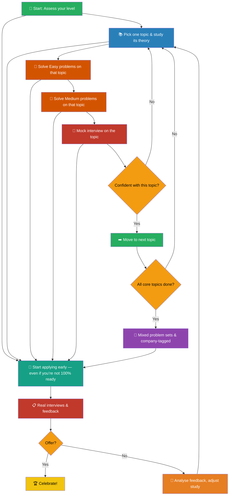

# 🚀 Internship Interview Guide — Brazil 🇧🇷  
### *From rejections to offers: a brutally honest, visual and actionable playbook*

> Written by a student who started from zero, failed a lot, learned more, and eventually got in.  
> **Goal:** Shorten your learning curve with field-tested strategies, visual roadmaps, and a curated resource hub — all adapted to the Brazilian tech hiring reality.  
> Questions or want to connect? Feel free to reach out to me on [LinkedIn](https://www.linkedin.com/in/amanda-fernandes-software-engineer/)

---

## 🧭 How to Navigate This Guide

Everything you need is right here, from high-level strategy to deep-dive resources.  
Company-specific sections link to my actual project repositories so you can see real code, real structures, and real solutions.  
Use the **Table of Contents** below to jump exactly where you need.  
If you prefer a visual journey, check the [📊 Visual Study Roadmap](#-visual-study-roadmap) section first.

---

## 📑 Table of Contents

- [📌 Internship Types & Strategic Preparation](#-internship-types--strategic-preparation)
- [⚔️ Live Coding vs Take‑Home Projects](#-live-coding-vs-take-home-projects)
- [🧠 The Ultimate Study Plan](#-the-ultimate-study-plan)
  - [Real Numbers & Baselines](#-real-numbers--baselines)
  - [My Honest Timeline](#-my-honest-timeline)
  - [What Actually Works (Evidence‑Based)](#-what-actually-works-evidence-based)
  - [📊 Visual Study Roadmap](#-visual-study-roadmap)
- [💬 Behavioral Interview Mastery](#-behavioral-interview-mastery)
- [🤖 Gen‑AI Internships (The New Frontier)](#-gen-ai-internships-the-new-frontier)
- [🏢 Company‑by‑Company Experiences](#-company-by-company-experiences)
  - [🎤 Live Coding](#-live-coding)
  - [📁 Take‑Home Projects](#-take-home-projects)
- [🧘 Mental Health & Sustainable Preparation](#-mental-health--sustainable-preparation)
- [📚 Ultimate Learning Resources & Deep Dives](#-ultimate-learning-resources--deep-dives)
  - [Data Structures & Algorithms](#data-structures--algorithms)
  - [System Design (Basics for Interns)](#system-design-basics-for-interns)
  - [Object‑Oriented Programming & Clean Code](#object-oriented-programming--clean-code)
  - [Behavioral Interviews](#behavioral-interviews)
  - [Gen‑AI & Emerging Tech](#gen-ai--emerging-tech)
  - [Big Tech Official Candidate Guides](#big-tech-official-candidate-guides)
  - [YouTube Channels & Video Courses](#youtube-channels--video-courses)
  - [Books Worth Your Time](#books-worth-your-time)
  - [LeetCode Roadmaps & Trackers](#leetcode-roadmaps--trackers)
  - [Competitive Programming (Optional, Low ROI)](#competitive-programming-optional-low-roi)

---

## 📌 Internship Types & Strategic Preparation

In Brazil, tech internships typically fall into two buckets. Understanding which one you’re targeting saves months of misplaced effort.

| Type | Duration | Typical Semester | Difficulty | Core Focus |
|------|----------|------------------|------------|-------------|
| 🟢 **Early‑stage** (e.g., Google Next Step, Uber Mulheres) | 2 years | 3rd–4th | Moderate | Arrays, Hash Maps, Strings, Two Pointers, OOP, Clean Code, Big O |
| 🔴 **Late‑stage** (e.g., Amazon, iFood, regular internships) | 6–12 months | 7th–8th | Higher | All above + Linked Lists, Stacks/Queues, Trees, Graphs, BFS/DFS |

> 🧩 **Underrepresented group programs** (women, Black, LGBTQIA+, PCD) often feature slightly more accessible questions. Never assume it will be easy, but talk to people who went through them — they’ll share what really matters.

**Probability‑based topic prioritisation** (based on frequency in Brazilian and global intern processes):

| Priority | Topics | Why |
|----------|--------|-----|
| 🔥 **Very High** | Arrays, Strings, Hash Maps, Trees, Graphs, Linked Lists, Stacks/Queues | 85%+ of all questions |
| ⚡ **Medium** | Heaps, Recursion, Dynamic Programming (basics), Sorting | Appears in later rounds or top companies |
| ❄️ **Low (don't obsess)** | Tries, Bit Manipulation, Greedy, Interval Merging, Segment Trees | Rare; only worth it if you have extra time |

---

## ⚔️ Live Coding vs Take‑Home Projects

Both formats test your engineering thinking, but the muscle you need to exercise is different.

| Aspect | 🎥 Live Coding | 📬 Take‑Home |
|--------|----------------|----------------|
| **Format** | Real‑time problem solving (video call) | Project delivered within a deadline (days) |
| **AI tools allowed** | ❌ No | ✅ Yes — but organisation & testing matter more than the code itself |
| **What is evaluated** | Problem‑solving process, communication, correctness, how you handle hints | Architecture, clean code, tests, documentation, Git history, deployment |
| **Critical skill** | Explaining while coding under pressure | Delivering production‑quality independently |

> 💡 **Communication is the hidden superpower in both.**  
> If the interviewer cannot follow your reasoning during live coding, even the optimal solution won’t save you. For take‑homes, a messy README or lack of tests will bury your technical brilliance.

---

## 🧠 The Ultimate Study Plan

### 📊 Real Numbers & Baselines

| Metric | My Experience | Community Baseline (r/leetcode, Blind, friends) |
|--------|---------------|--------------------------------------------------|
| **Total prep time** | ~1 year (on and off) | 3–6 months focused is typical |
| **LeetCode problems solved** | ~200 | 150–200 is the sweet spot for most internship candidates |
| **Competitive programming** | ~50 | Optional — low ROI for standard interviews |
| **Advent of Code** | ~50 stars | Fun, but not interview‑optimised |
| **Theory study** | Heavy (started from zero) | Depends on your CS foundation |

### 📅 My Honest Timeline

I started from scratch, and a huge part of the journey wasn't solving problems—it was learning the fundamentals first. Understanding Big O notation and data structures laid the foundation for everything that came after.

I spent roughly **1 year** preparing, but it was completely unbalanced:

- 🏫 **During semesters:** almost nothing. Classes drained me and I barely touched LeetCode.
- ⛱️ **During breaks/holidays:** full degenerate mode. 8–12 hours/day, 10+ problems daily, zero rest.

> 🚨 **Do not do this.** By the end of every break I was mentally fried and practically had no rest.  
> **I don’t recommend it.** What I do recommend:

### ✅ What Actually Works (Evidence‑Based)

**Pacing that sticks:**

- 🗓️ **Weekdays:** 1–2 problems/day. Consistency beats cramming.
- 🗓️ **Weekends/holidays:** 5–8 problems/day max. Beyond that, diminishing returns kick in hard.
- 📚 **Theory days:** Reserve 1–2 days/week for concept study only, no solving.

**Method – learn by doing, one topic at a time:**

1. **Pick one topic** from the NeetCode 250 roadmap (e.g., Arrays, Hash Maps, Trees).
2. **Study its theory in one go** – watch video explanations, read a chapter, understand the common patterns.
3. **Start coding immediately** – solve Easy problems first, then Medium ones. Don’t jump to the next topic until you can solve Mediums comfortably.
4. Each cycle (2–3 weeks) covers one topic completely: theory → Easy → Medium → mock interview.
5. **Spaced repetition:** re-solve the same problems after 1 week and again after 2–3 weeks.
6. **Apply early, even if you feel you’re not ready.** Spoiler: you’ll never feel 100% ready. Use real interviews as a feedback loop – every rejection shows you exactly where to improve.

**Why consistency > cramming:**  
LeetCode is a muscle. You don’t build it with 10‑hour leg days once a month — you build it with steady, moderate training. People who solve 1–2 problems daily for 3 months consistently outperform those who binge 100 problems in two weeks and burn out. This isn’t just my opinion; it’s the most common pattern among successful candidates on r/leetcode, Blind, and every interview prep community.

### 📊 Visual Study Roadmap

> 🔗 **Essential links:** [NeetCode.io](https://neetcode.io) · [LeetCode](https://leetcode.com) · [Cracking the Coding Interview (book)](https://www.amazon.com/Cracking-Coding-Interview-Programming-Questions/dp/0984782850)

---

## 💬 Behavioral Interview Mastery

**Framework:** **STAR** – Situation, Task, Action, Result.

### 🛠️ How to prepare:

1. List 5–7 strong stories from projects, university, hackathons, group work, or even personal initiatives.
2. Write each in STAR format using bullet points, **not** scripts — you want to sound natural, not robotic.
3. Practice with AI (ChatGPT voice mode, Interviewing.io mock) or a buddy. Aim for 5 minutes max per story.
4. Cover these categories:
   - 🤝 Teamwork & collaboration
   - 💥 Conflict resolution
   - 📉 Failure & what you learned
   - 🧭 Leadership & initiative
   - 📚 Learning something new quickly
   - 😰 Handling pressure & tight deadlines

> 💎 **What interviewers really want:** self‑awareness, ownership, growth mindset, and clear communication.  
> They want to see that you reflect, adapt, and don’t blame others. Every story should highlight what *you* did and what you learned.

---

## 🤖 Gen‑AI Internships (The New Frontier)

Companies are increasingly adding AI/ML questions even for standard Software Engineering internships. You don’t need to be a data scientist, but you must show awareness.

### 🧠 Concepts to know (surface level):

- **RAG** (Retrieval‑Augmented Generation)
- **MCP** (Model Context Protocol — yes, it’s showing up in interviews)
- **Guard rails** & responsible AI
- **AI agents** & orchestration
- **ML training basics** (supervised vs unsupervised, overfitting, evaluation metrics)
- **Fine‑tuning vs prompt engineering**
- **LGPD / GDPR awareness** (data privacy in AI contexts)

### 🛠️ Daily tools to master (use them until they feel natural):

- **GitHub Copilot** / **Cursor** / **Codeium**
- **ChatGPT** / **Claude** / **Gemini**
- **Perplexity** for research

> ✅ **You do NOT need:** deep math, training models from scratch, or PyTorch expertise (unless the role explicitly requires it).  
> Focus on building a simple Gen‑AI side project (e.g., a RAG chatbot over a PDF) — that’s enough to stand out.

---

## 🏢 Company‑by‑Company Experiences

Below are real processes I went through. Expand each company to see the format, topics, tips, and a link to my solution repository.

### 🎤 Live Coding

🟠 Amazon

- **Program:** Amazon Mulheres 2025 (late‑stage)
- **Duration:** 6‑month internship
- **Format:** Online Assessment (OA) + 1 technical interview (live coding)
- **Topics:** Trees, Hash Maps, Arrays — LeetCode Medium level
- **🔑 Tips:**
  - The OA often includes a work simulation and behavioral questions — treat them seriously.
  - In the live round, explicitly state your assumptions and test your code with examples.
- **📂 My prep repo:** [🔗 amazon‑interview‑prep](https://github.com/your/amazon-prep)

🔵 Google

- **Program:** Google Next Step 2026 (early‑stage)
- **Duration:** 2‑year internship
- **Format:** 2 technical interviews (live coding, Google Meet + shared doc)
- **Topics:** Arrays, Strings, Graph traversal (BFS/DFS) — clean, readable code matters more than perfection
- **🔑 Tips:**
  - Practice coding without an IDE; use a simple text editor or whiteboard.
  - Communicate your thought process before writing a single line.
- **📂 My prep repo:** [🔗 google‑internship‑prep](https://github.com/your/google-prep)

⚫ Uber

- **Program:** Uber Mulheres 2025 (early‑stage)
- **Duration:** 2‑year internship
- **Format:** OA (CodeSignal) + 1 technical round
- **Topics:** Hash Maps, Two Pointers, OOP design basics
- **🔑 Tips:**
  - CodeSignal has a scoring system; speed and correctness both matter — practice with timed tests.
  - Expect an OOP design question (e.g., design a parking lot or deck of cards).
- **📂 My prep repo:** [🔗 uber‑internship‑prep](https://github.com/your/uber-prep)

### 📁 Take‑Home Projects

🟣 Artefact

- **Challenge type:** Build a REST API with a specific data set
- **Deadline:** 7 days
- **What they evaluated:** Code organisation, tests (unit + integration), documentation, Git commit history
- **🔑 Tips:**
  - Use a clear folder structure (controllers, services, models, etc.).
  - Include a well‑written README with setup instructions and design decisions.
- **📂 My project:** [🔗 artefact‑challenge](https://github.com/your/artefact-challenge)

🔵 DTI

- **Challenge type:** Full‑stack application (React + Node)
- **Deadline:** 5 days
- **What they evaluated:** Architecture, clean code, deployment (Docker / Vercel)
- **🔑 Tips:**
  - Deploy it. A live demo beats a local‑only repo.
  - Use environment variables and explain how to configure them.
- **📂 My project:** [🔗 dti‑challenge](https://github.com/your/dti-challenge)

🟢 Grupo Fácil

- **Challenge type:** Feature implementation in an existing codebase
- **Deadline:** 3 days
- **What they evaluated:** Code quality, problem‑solving, ability to understand legacy code
- **🔑 Tips:**
  - Don’t rewrite everything; show incremental improvement.
  - Add tests for the new feature.
- **📂 My project:** [🔗 grupo‑facil‑challenge](https://github.com/your/grupo-facil-challenge)

🔴 iFood

- **Challenge type:** Microservice + tests
- **Deadline:** 10 days
- **What they evaluated:** Scalability, testing (unit, integration, contract), documentation, containerisation
- **🔑 Tips:**
  - Use a message broker or event‑driven pattern if applicable; they love seeing architectural thinking.
  - Write a design doc (simple markdown) explaining trade‑offs.
- **📂 My project:** [🔗 ifood‑challenge](https://github.com/your/ifood-challenge)

⚪ Stech

- **Challenge type:** Algorithmic problem + written report
- **Deadline:** 4 days
- **What they evaluated:** Logic, clarity of explanation, Big O analysis
- **🔑 Tips:**
  - The report is as important as the code. Explain your approach step by step.
  - Include complexity analysis (time and space).
- **📂 My project:** [🔗 stech‑challenge](https://github.com/your/stech-challenge)

---

## 🧘 Mental Health & Sustainable Preparation

Interview prep is a marathon, not a sprint. The industry moves fast — AI tools change weekly, expectations shift, and it’s easy to feel perpetually behind.

**You’re not.**

### 🛡️ Protect your energy:

- 🧱 **Focus on fundamentals** over hype. Core DS&A never expires.
- 🤖 **Use AI tools daily** so they feel natural, not intimidating.
- 🎯 **You don’t need to know everything.** Nobody does. Prioritise depth over breadth.
- 🌿 **Take breaks, touch grass, sleep properly.** Your brain consolidates learning during rest.
- 🔥 **Burnout costs more than skipping one study session.** Consistency beats heroic all‑nighters.

Every rejection is data. Every interview teaches something. Keep going.  
**Good luck. You’ve got this.** 💪

---

## 📚 Ultimate Learning Resources & Deep Dives

*A curated, opinionated library for each skill you need. Star the ones that fit your style.*

### Data Structures & Algorithms

| Resource | Type | Why It’s Good |
|----------|------|---------------|
| [NeetCode 250](https://neetcode.io/practice) | Roadmap + video solutions | The gold standard for internship prep. Follow the roadmap blindly. |
| [Abdul Bari’s Algorithms Course](https://www.youtube.com/playlist?list=PLDN4rrl48XKpZkf03iYFl-O29szjTrs_O) | YouTube | Masterful visual explanations for recursion, trees, DP, etc. |
| [MIT 6.006 Introduction to Algorithms (free)](https://ocw.mit.edu/courses/6-006-introduction-to-algorithms-spring-2020/) | University course | For a deep theoretical foundation. Use selectively. |
| [AlgoMonster](https://algo.monster/) | Interactive platform | Pattern‑based learning with a flowchart approach. Great for visual learners. |

### System Design (Basics for Interns)

| Resource | Type | Note |
|----------|------|------|
| [System Design Interview – An Insider’s Guide (Alex Xu)](https://www.amazon.com/System-Design-Interview-Insiders-Guide/dp/1736049119) | Book | Read the first few chapters to understand scaling, caching, load balancing. |
| [Gaurav Sen’s System Design Playlist](https://www.youtube.com/c/GauravSensei) | YouTube | Short, precise videos on core concepts. Perfect for interns. |

### Object‑Oriented Programming & Clean Code

| Resource | Type | Why |
|----------|------|-----|
| [Refactoring.Guru](https://refactoring.guru/) | Web | Visual explanations of design patterns and SOLID. |
| [Clean Code (Robert C. Martin)](https://www.amazon.com/Clean-Code-Handbook-Software-Craftsmanship/dp/0132350882) | Book | The classic, but read only the first half to avoid dogma. |
| [CodeAesthetic (YouTube)](https://www.youtube.com/@CodeAesthetic) | Videos | Clean code principles explained with clean visuals. |

### Behavioral Interviews

| Resource | Type | Why |
|----------|------|-----|
| [Amazon Leadership Principles](https://www.amazon.jobs/content/en/our-workplace/leadership-principles) | Official | Most big tech behavioral questions mirror these. Prepare 2 stories per principle. |
| [Interviewing.io Behavioral Guide](https://interviewing.io/guides/behavioral-interview) | Guide | Solid, free advice with example answers. |
| [STAR Method Refinement (Jeff H Sipe)](https://www.youtube.com/watch?v=0nN7wB_SatI) | YouTube | Practical walkthrough of transforming a story into STAR. |

### Gen‑AI & Emerging Tech

| Resource | Type | Why |
|----------|------|-----|
| [DeepLearning.AI Short Courses](https://www.deeplearning.ai/short-courses/) | Free courses | “LangChain for LLM Application Development” and “Building Systems with ChatGPT” are excellent. |
| [Hugging Face NLP Course](https://huggingface.co/learn/nlp-course) | Interactive | Learn tokenization, transformers, and RAG from scratch. |
| [Weights & Biases (YouTube)](https://www.youtube.com/@WeightsBiases) | Channel | Demystifies ML experiment tracking and basics. |

### Big Tech Official Candidate Guides

> 💼 **Bookmark these** — they’re straight from the source.

- **Google:** [Prepare for a Google Engineering Interview](https://careers.google.com/interview-tips/) — includes coding, system design, and leadership.
- **Amazon:** [Interviewing at Amazon](https://www.amazon.jobs/en/landing_pages/interviewing-at-amazon) — behavioral (Leadership Principles) + technical.
- **Uber:** [Uber Engineering Interview Prep](https://www.uber.com/us/en/careers/interview/) — (sometimes called “Uber University” internally) contains live coding expectations and a prep guide.
- **Microsoft:** [Microsoft Interview Tips](https://careers.microsoft.com/v2/global/en/hiring-tips) — similar to Google, with an emphasis on collaboration.
- **Meta (Facebook):** [Meta Careers Interview Preparation](https://www.metacareers.com/life/preparing-for-your-engineering-interview) — structured question bank and process description.

### YouTube Channels & Video Courses

| Channel | Best For |
|---------|----------|
| [NeetCode](https://www.youtube.com/c/NeetCode) | Blind 75/150/250 video solutions, system design basics. |
| [CS Dojo](https://www.youtube.com/c/CSDojo) | Beginner‑friendly DSA explanations. |
| [takeUforward (Striver)](https://www.youtube.com/c/takeUforward) | In‑depth DSA sheets and interview experiences. |
| [freeCodeCamp](https://www.youtube.com/c/Freecodecamp) | Full‑length courses (DSA, web dev, system design). |
| [Fireship](https://www.youtube.com/c/Fireship) | Quick overviews of modern tech, AI trends (great for conversational awareness). |

### Books Worth Your Time

- *Cracking the Coding Interview* – Gayle Laakmann McDowell
- *Grokking Algorithms* – Aditya Bhargava (visual, intuitive)
- *Elements of Programming Interviews* (Python/C++/Java) – Adnan Aziz et al. (more advanced, use after Cracking)
- *The Pragmatic Programmer* – David Thomas & Andrew Hunt (mindset, not DSA)
- *Designing Data‑Intensive Applications* – Martin Kleppmann (only for late‑stage or full‑time prep)

### LeetCode Roadmaps & Trackers

- 📋 [NeetCode 250 Roadmap](https://neetcode.io/practice) – the one I used.
- 📋 [Grind 75](https://www.techinterviewhandbook.org/grind75) – adaptive, less overwhelming.
- 📋 [Sean Prashad LeetCode Patterns](https://seanprashad.com/leetcode-patterns/) – grouped by pattern, excellent for after topic study.
- 📊 [LeetCode Progress Tracker (Notion template)](https://www.notion.so/templates/leetcode-progress-tracker) – keep yourself accountable.

### Competitive Programming (Optional, Low ROI)

- [Codeforces](https://codeforces.com/) / [AtCoder](https://atcoder.jp/)
- Only dive in if you enjoy it. For internship interviews, it’s overkill. Better to spend time on LeetCode.

---

*This guide will evolve. If you have insights from your own process, feel free to open a PR or reach out on LinkedIn. Let’s help the next generation of Brazilian devs break into tech.* 🌎🚀
